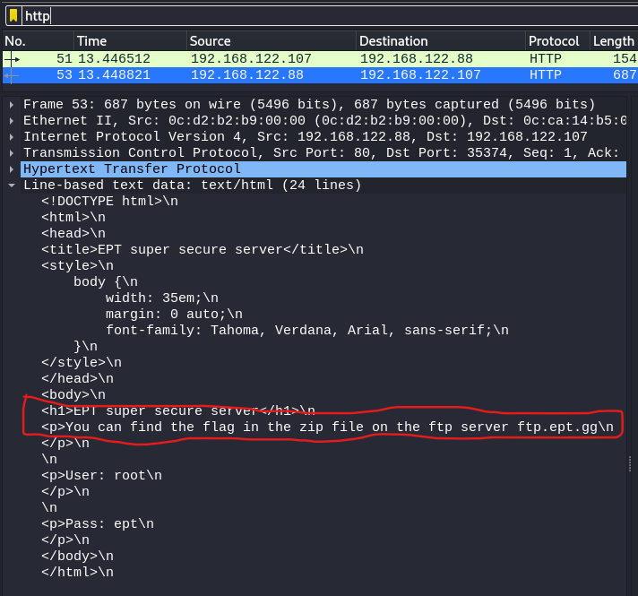
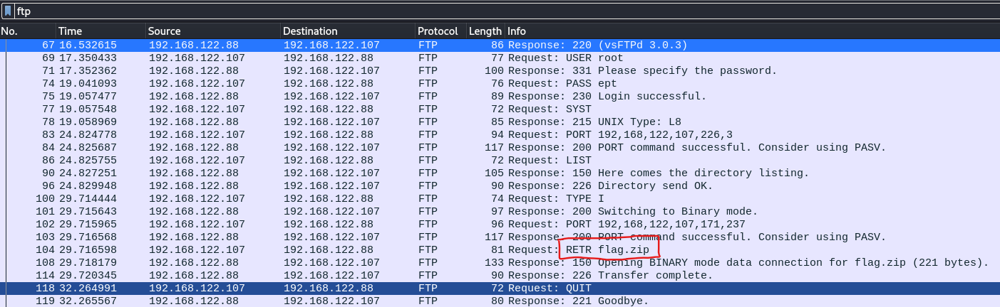
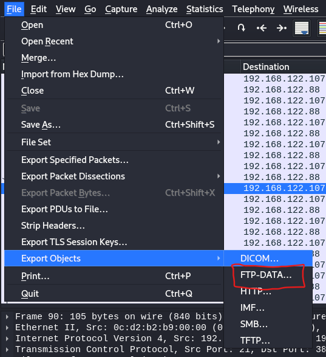
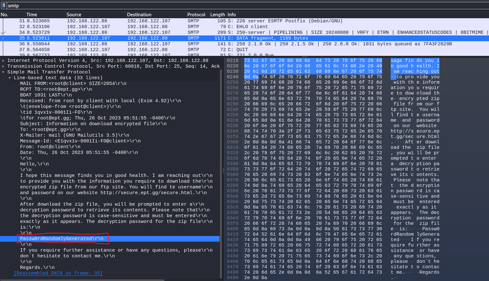
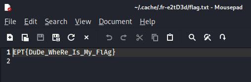

# secured_writeup
Writeup for the Secured Exchange CTF at Equinor EPT CTF 2023

The task:
  "Our financing department has developed their own ultra secure methods of transferring vital financial reports. See if you can find a flaw in their plan"

I download the attached secured.pcap file, and fire up Wireshark.

Quickly scrolling down I see there are packets being sent through some interesting protocols, such as FTP, HTTP and SMTP.
I start off with HTTP, and quickly find some clues to where to search next.

Possible clues: 
    FTP server = ftp.ept.gg
    Username = root
    Paassword = ept
    Flag = zip file

Attempts to access an FTP server at that address gave no result and as i didn't start any VMs either, this could very well just be a distraction.

Instead I turned back to checking out the other protocols in Wireshark, this time FTP as it was mentioned in the HTTP packet.

Here I found someone that has used the FTP server, logging in and downloading the flag.zip file, that looks to be my goal.

But, if I can't access the FTP server, how will I be able to retrieve the zip file?
There is a function in Wireshark that lets you extract objects from the pcap file itself.

Thinking this was it, I was hit with a password prompt and had to go back to digging.
I could always try to crack the password with either a wordlist or just brute force.. But that could take some time, so I went back to Wireshark.

Now checking out the last protocol I saw, SMTP, as this is used for email and it could give me some more clues.

Would you look at that! We found an email containing a password! Let's give it a try on the zip file.

Success! I decompressed the zip file, found a flag.txt file and got the flag!

EPT{DuDe_WheRe_Is_My_FlAg}

